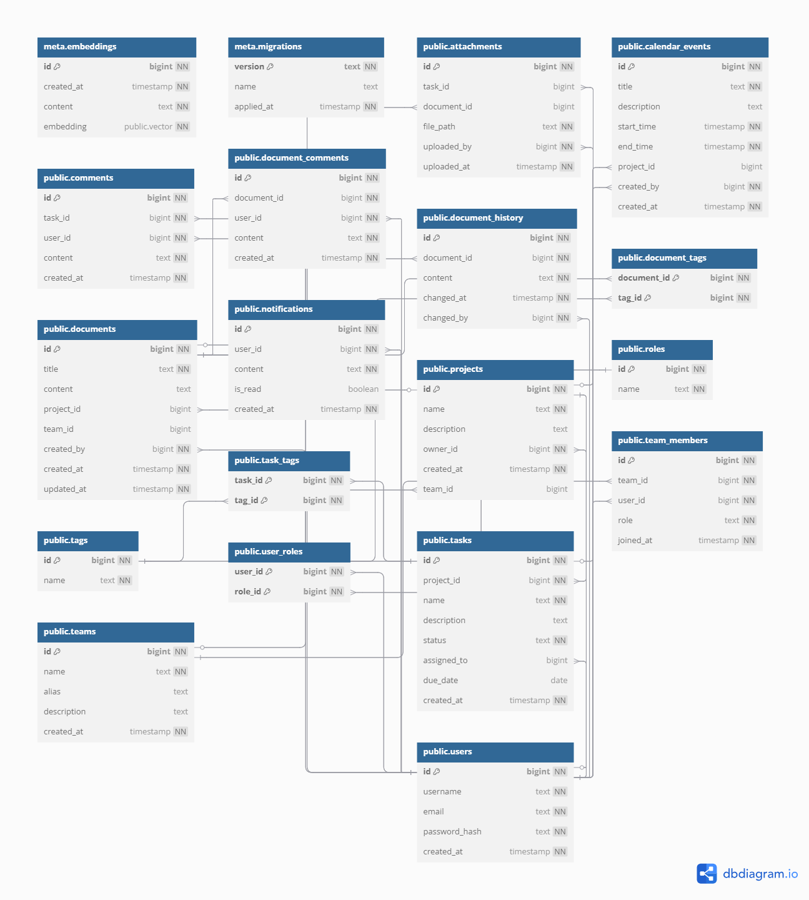

# TuDu Server



## 🚀 Technologies Used

- **Rust** (Backend)
- **Axum** (Web framework)
- **Diesel** (ORM for Rust)
- **MySQL** (Database)
- **Docker & Docker Compose** (Containerization and deployment)
- **Serde** (Serialization and deserialization)
- **Tokio** (Asynchronous runtime)

---

## 🐳 Running the Project with Docker

### Prerequisites

- [Docker](https://www.docker.com/)
- [Docker Compose](https://docs.docker.com/compose/)

### Steps

1. **Clone the repository:**
   ```bash
   git clone https://github.com/arkeasz/tudu.git
   cd tudu/server
   ```

2. **Create a `.env` file:**
   ```env
   MYSQL_PASSWORD=yourpassword
   MYSQL_DATABASE=yourdatabase
   MYSQL_USER=youruser
   DATABASE_URL_DOCKER=mysql://youruser:yourpassword@db:3306/yourdatabase
   ```

3. **Run the containers:**
   ```bash
   docker-compose up --build
   ```

4. **Access the application:**
   Open your browser and go to:
   ```
   http://localhost:8080
   ```

---

## 🌐 API Endpoints

### `GET /`
- **Description:** Root endpoint to check if the server is running.

### `GET /users`
- **Description:** Retrieves a list of users.
- **Response:**
  ```json
  [
    {
      "id": 1,
      "username": "john_doe",
      "email": "john@example.com",
      "created_at": "2024-01-01T12:00:00Z"
    }
  ]
  ```

### `POST /register`
- **Description:** Registers a new user.
- **Request Body:**
  ```json
  {
    "email": "john@example.com",
    "password": "securepassword",
    "username": "john_doe"
  }
  ```
- **Response:**
  ```json
  {
    "id": 1,
    "email": "john@example.com",
    "username": "john_doe"
  }
  ```

### `POST /login`
- **Description:** Authenticates a user.
- **Request Body:**
  ```json
  {
    "email": "john@example.com",
    "password": "securepassword"
  }
  ```
- **Response (Success):**
  ```json
  {
    "message": "Login successful",
    "token": "your-jwt-token"
  }
  ```
- **Response (Error):**
  ```json
  {
    "error": "Invalid credentials"
  }
  ```

### `PUT /users/{id}`
- **Description:** Updates user information.
- **Request Body:**
  ```json
  {
    "username": "new_username",
    "email": "new_email@example.com",
    "password_hash": "new_hashed_password"
  }
  ```

### `DELETE /users/{id}`
- **Description:** Deletes a user by ID.
- **Response:**
  ```json
  {
    "message": "User deleted successfully"
  }
  ```

---

## 📦 Deployment

With Docker support, you can deploy this server to any cloud provider that supports Docker, such as:

- **AWS (Elastic Beanstalk / ECS)**
- **Azure App Service**
- **Google Cloud Run**
- **DigitalOcean App Platform**
- **Heroku (with Docker support)**

Ensure that your `.env` file has the correct production environment variables for the deployment environment.
